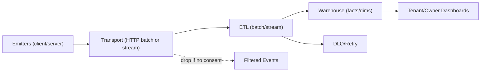

# Warehouse Integration (Initial Plan)

## Purpose
Define how events flow into a warehouse for analytics dashboards, with scale and compliance in mind.

## Scope (Phase 0.10)
- Event transport: choose batch/stream mechanism (decision in 0.10).
- Warehouse: select engine (decision in 0.10); design facts/dimensions.
- Consent-aware filtering; no PII; honor opt-out.
- Partitioning/retention for scale; multi-tenant separation where needed.

## Data Model (high level)
- Facts: events (auth/content/progress/toolkit/community/marketplace later).
- Dimensions: user (limited), tenant, course, content, time, locale, device (optional).
- Include tenant/locale in all facts; avoid storing sensitive user attributes.

## KPIs (initial examples)
| Dashboard      | KPI                              | Notes/Targets (tune later)              |
|----------------|----------------------------------|-----------------------------------------|
| Tenant         | DAU/WAU/MAU per tenant           | Segmented by locale/device              |
| Tenant         | Course completion rate           | Per course/module                       |
| Tenant         | Lesson engagement                | Avg time on lesson; drop-off points     |
| Tenant         | Toolkit usage                    | Runs per block type                     |
| Tenant         | Marketplace revenue (if enabled) | GMV by listing type                     |
| Owner          | Platform health (errors/latency) | SLOs fed from observability stack       |
| Owner          | Overall retention/churn          | Cohorts; by tenant segment              |
| Owner          | Consent opt-in rate              | By locale/tenant                        |
| Owner          | Marketplace revenue/payouts      | Refund rates, payout lag                |

## Retention & Aggregation Windows (initial)
| Event Family          | Raw Retention | Aggregation Windows             | Notes                                    |
|-----------------------|---------------|---------------------------------|------------------------------------------|
| Auth                  | 90 days       | Daily/weekly counts             | Drop PII; keep counts only               |
| Content views         | 180 days      | Daily/hourly buckets            | Aggregate for dashboards                 |
| Progress              | 365 days      | Daily per course/module         | Tie to progress cards                    |
| Toolkit interactions  | 180 days      | Daily/hourly per block type     | Needed for engagement insights           |
| Community             | 365 days      | Daily/weekly per forum/thread   | Moderate counts only                     |
| Marketplace           | 365 days      | Daily revenue/refund/payout     | Retention aligned with finance policies  |

## Pipelines
- Ingestion from client/server emitters → ETL (batch/stream) → warehouse tables.
- Monitoring/alerting on pipeline health; retries/DLQ strategy.
- Candidates (decide in 0.10):
  - Batch: HTTP batch → worker → staging table → daily/hourly ETL → facts/dims.
  - Stream: queue (Kafka/PubSub/SQS) → consumers → facts/dims; DLQ on failure.
- Consider aggregation/caching layer for dashboards to meet perf budgets.

## Usage
- Tenant dashboards (engagement/progress/toolkit).
- Owner dashboards (platform-wide metrics).

## Future
- Additional facts for marketplace, recommendations; ML/recos consumption.
- Region-aware storage for data residency; caching/aggregation layers for dashboards.***
## Decision Log (fill in during 0.10)
- Transport: batch vs stream; payload limits; retry policy.
- Warehouse: engine, region, retention defaults; partitioning column (e.g., `tenantId`, date).
- BI/charting: chosen tool and embedding approach.
- Monitoring: alert thresholds (lag, error %, DLQ depth).
- Charting choice: when selected, record library/tool, embedding method, auth model, and performance budget.
- Chosen stack (fill when decided):
  - Transport: HTTP batch (initial), consider stream later
  - Warehouse engine/region: Neon/Postgres (analytics schema) in primary region (TBD), revisit if moving to dedicated warehouse
  - Charting/BI tool: Metabase (embedded), auth via JWT/session passthrough
  - Caching/aggregation layer: Postgres materialized views + scheduled refresh; Redis cache if needed later
