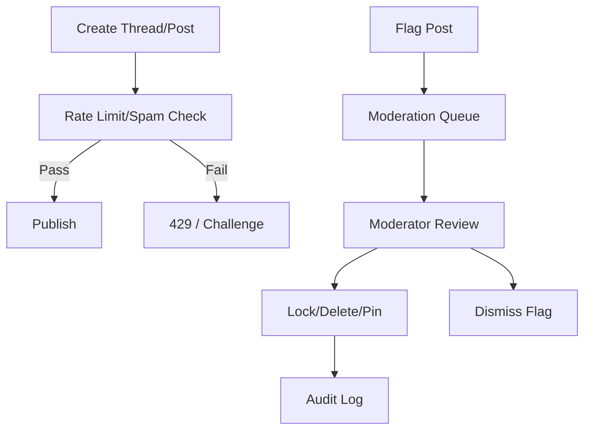

# Community API (Initial)

Expose forums/threads/posts for tenant communities.

## Endpoints (skeleton)
- GET /api/forums — list forums; filters: `tenantId`; pagination `limit` default 20 (max 50), `cursor`; sort `-updatedAt`.
- POST /api/forums — create forum (tenant admin/moderator).
- GET /api/forums/:forumId — forum detail.
- GET /api/forums/:forumId/threads — list threads; filters: `authorId?`, `q?`; pagination `limit` default 20 (max 50), `cursor`; sort `-updatedAt`.
- POST /api/forums/:forumId/threads — create thread.
- GET /api/threads/:threadId/posts — list posts; pagination `limit` default 50 (max 100), `cursor`; sort `createdAt`.
- POST /api/threads/:threadId/posts — create post.
- PATCH /api/threads/:threadId/posts/:postId — edit post (author/moderator).
- DELETE /api/threads/:threadId/posts/:postId — soft-delete (author/moderator).
- POST /api/threads/:threadId/lock — lock thread (moderator/admin).
- POST /api/threads/:threadId/pin — pin/unpin thread (moderator/admin).
- POST /api/threads/:threadId/posts/:postId/flag — flag post (any user).
- GET /api/reports — list flags/reports (moderator/admin), paginated.

## Validation (examples)
| Field        | Required | Type    | Constraints                                  |
|--------------|----------|---------|----------------------------------------------|
| title        | Yes      | string  | 1–200 chars                                  |
| body/content | Yes      | string  | 1–5000 chars; sanitized; no dangerous HTML   |
| forumId      | Yes      | string  | Must exist; tenant-scoped                    |
| threadId     | Yes      | string  | Must exist within forum                      |
| postId       | Yes      | string  | Must exist within thread                     |
| limit        | No       | number  | Forums/threads default 20 (max 50); posts default 50 (max 100) |
| cursor       | No       | string  | Token from previous page                     |
| sort         | No       | string  | Whitelist; defaults noted above              |
| attachmentUrl| No       | string  | Allowed domains only; size/type limits apply |
| lock/pin     | Yes      | boolean | For pin/unlock actions                       |
| flag.reason  | Yes      | string  | 1–500 chars; reason codes optional           |
| flag.type    | No       | enum    | e.g., `spam` \| `abuse` \| `offtopic`        |
| attachmentSize| No      | number  | Max 5MB (image/pdf); reject otherwise        |
| attachmentType| No      | string  | Allowlist: `image/png`, `image/jpeg`, `application/pdf` |

## Sample Payloads
### Create Thread
```json
POST /api/forums/forum-1/threads
{ "title": "Exam prep tips", "body": "Share resources and questions here." }
```
Response:
```json
{ "threadId": "thread-9", "forumId": "forum-1", "title": "Exam prep tips", "createdBy": "user-1", "createdAt": "2025-01-01T00:00:00Z" }
```

### Create Post
```json
POST /api/threads/thread-9/posts
{ "body": "I recommend focusing on vector calculus." }
```
Response:
```json
{ "postId": "post-3", "threadId": "thread-9", "body": "I recommend focusing on vector calculus.", "createdBy": "user-2", "createdAt": "2025-01-01T00:00:00Z" }
```

### Flag Post
```json
POST /api/threads/thread-9/posts/post-3/flag
{ "reason": "Contains spam links", "type": "spam" }
```
Response:
```json
{ "flagId": "flag-1", "status": "received" }
```

## Rules
- Auth required; enforce roles per permission system (student can post, moderator can edit/delete).
- Respect tenant scoping; hide forums/threads not accessible.
- Sanitize content; enforce size limits; externalise UI strings on client.
- Emit events for thread/post create/view (consent-aware).
- Moderation: lock/pin by moderators/admins; soft-delete retains audit trail; flags routed to moderation queue.
- Attachments/media: allowlisted domains/storage only; enforce type/size caps; virus scan if available.
- Anti-spam: rate limit thread/post/flag creation; consider captcha/throttling for bursty behavior; redact/strip links if policy requires.
- Attachments:
  - Allowlist types: `image/png`, `image/jpeg`, `application/pdf` (extend if needed).
  - Max size: 5MB; reject larger uploads/links.
  - Storage: host-served or approved CDN only; no user-supplied arbitrary URLs unless proxied/sanitized.

## Errors (catalog)
| HTTP | Code                 | Message (example)                     | When                                      |
|------|----------------------|---------------------------------------|-------------------------------------------|
| 400  | `invalid_request`    | "Title is required"                   | Validation failure                        |
| 401  | `unauthorized`       | "Authentication required"             | Missing/invalid auth                      |
| 403  | `forbidden`          | "Insufficient permissions"            | Lacking role/mod powers                   |
| 404  | `not_found`          | "Thread not found"                    | Unknown forum/thread/post                 |
| 409  | `conflict`           | "Cannot delete locked thread"         | Business rule conflict                    |
| 429  | `rate_limited`       | "Too many requests"                   | If rate limiting enabled                  |
| 409  | `locked`             | "Thread is locked"                    | Posting when locked                       |
| 403  | `moderation_required`| "Moderator role required"             | Lock/pin/delete without rights            |

## Future
- Moderation endpoints (lock thread, pin, report/flag).
- Attachments/media guidelines; reactions/upvotes.***

