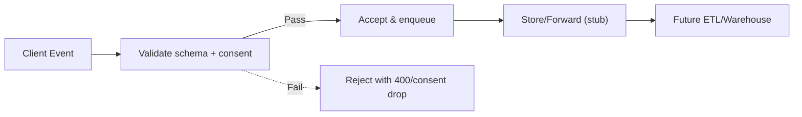

# Events API (Stub)

Early phases use client/server emitters and stub ingestion. Full pipeline defined in Phase 0.10.

## Purpose
- Provide schemas and optional ingestion endpoint for client/server events.
- Transport options: HTTP batch (initial) or stream (future); consent-aware filtering required.

## Payload Schema
- Event object: `{ name, timestamp, tenantId, userId?, locale, context }`
- Required: `name`, `timestamp` (ISO), `tenantId`, `locale`
- Optional: `userId` (when allowed), `context` (object; type-specific fields per `docs/analytics/event-types.md`)

### Sample Payload
```json
{
  "events": [
    {
      "name": "progress.update",
      "timestamp": "2025-01-01T12:00:00Z",
      "tenantId": "tenant-123",
      "userId": "user-456",
      "locale": "en-US",
      "context": {
        "courseId": "course-1",
        "lessonId": "lesson-9",
        "status": "in_progress",
        "percent": 40
      }
    }
  ]
}
```

## Validation/Errors
- Validate required fields and event names against allowed types.
- Required fields: `name`, `timestamp` (ISO), `tenantId`, `locale`; `userId` required when event type demands an actor.
- Batch limits: max 500 events or 256KB payload (tune later).
- Structured errors: `{ code, message, details? }`
- Drop/ignore events if consent not given; do not return sensitive error details.
- Apply rate limits if exposed; consider 413 for oversized payloads.
- Deduplicate by `(name, timestamp, userId?, tenantId, context.hash)` when provided to avoid double counting.

### Field Validation
| Field     | Required      | Type    | Constraints                                 |
|-----------|---------------|---------|---------------------------------------------|
| name      | Yes           | string  | Must match allowed event types              |
| timestamp | Yes           | string  | ISO 8601                                    |
| tenantId  | Yes           | string  | Non-empty                                   |
| userId    | Conditional   | string  | Required if event type requires actor       |
| locale    | Yes           | string  | BCP 47                                      |
| context   | Yes           | object  | Validated per event type (see event-types)  |

## Endpoints (Stub)
- POST /api/events — accept batched events (optional in early phases); consent-aware.
  - Payload: `{ events: [ { name, timestamp, tenantId, userId?, locale, context } ] }`
  - Validate against event types; drop/skip if consent not given.
- Response example (per-event status):
```json
{
  "accepted": 1,
  "rejected": 1,
  "results": [
    { "name": "progress.update", "status": "accepted" },
    { "name": "unknown.event", "status": "rejected", "code": "invalid_event" }
  ]
}
```

## Errors (Catalog)
| HTTP | Code                | Message (example)                      | When                                      |
|------|---------------------|----------------------------------------|-------------------------------------------|
| 400  | `invalid_event`     | "Invalid event name"                   | Name not allowed                          |
| 400  | `invalid_payload`   | "Missing required fields"              | Missing name/timestamp/tenantId/locale    |
| 400  | `payload_too_large` | "Event batch exceeds size limits"      | Over size/count limits                    |
| 401  | `unauthorized`      | "Authentication required"              | If auth enforced                          |
| 403  | `consent_required`  | "Consent not granted"                  | Consent off                               |
| 413  | `payload_too_large` | "Event batch exceeds size limits"      | Same as above                             |
| 429  | `rate_limited`      | "Too many requests"                    | If rate limiting enabled                  |

## Webhook/Callback (if used)
- Require HTTPS and signature verification on inbound callbacks (if exposing ingestion as webhook).
- Enforce idempotency keys to prevent duplicate processing.
- Retry on 5xx with backoff; drop/alert on repeated signature failures.
- Example (pseudo):
  - Signature header: `X-Signature: sha256=<hmac>`
  - Compute HMAC over raw body with shared secret; compare in constant time.
  - Require `Idempotency-Key` header; reject duplicates.
  - Example (Node/TS-style pseudo):
```ts
const sig = req.headers["x-signature"];
const body = rawBody; // unparsed
const expected = "sha256=" + hmacSha256(secret, body);
if (!timingSafeEqual(sig, expected)) return res.status(401).json({ code: "invalid_signature" });
const idem = req.headers["idempotency-key"];
if (!idem || seen(idem)) return res.status(409).json({ code: "duplicate" });
markSeen(idem);
```

## Rules
- Enforce payload validation; rate limit if exposed.
- No PII in events; follow security/compliance; structured errors.
- Error examples:
  - 400: `{ "code": "invalid_event", "message": "Invalid event name", "details": { "name": "foo" } }`
  - 413: `{ "code": "payload_too_large", "message": "Event batch exceeds size limits" }`
- Successful response: `{ "accepted": <number>, "rejected": <number> }`

## Future
- Route to warehouse/analytics pipeline; add auth where needed; observability/monitoring for ingestion.***

