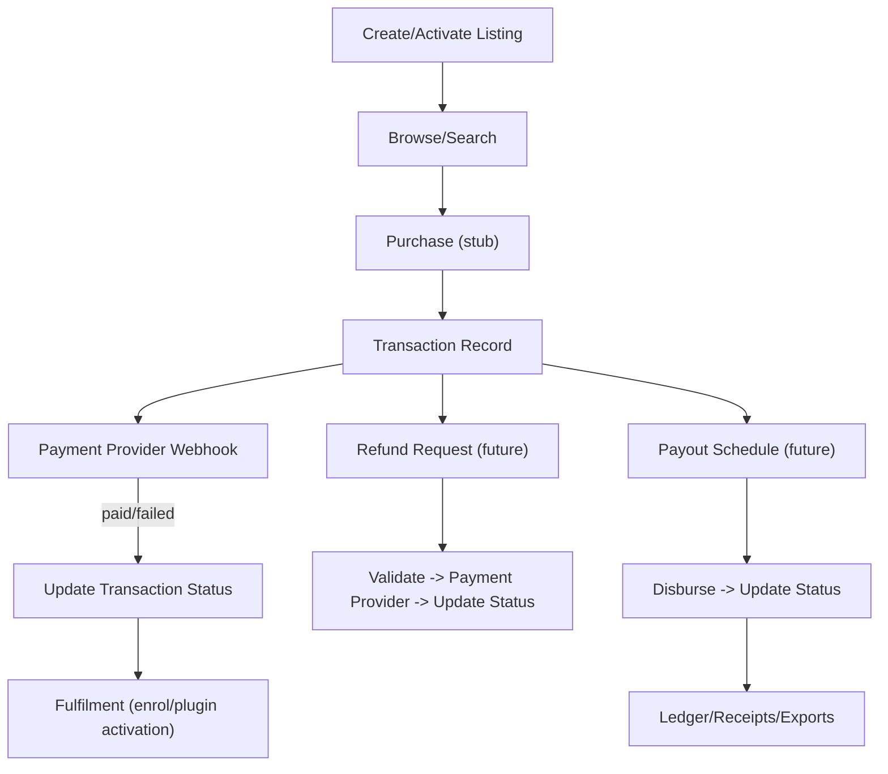
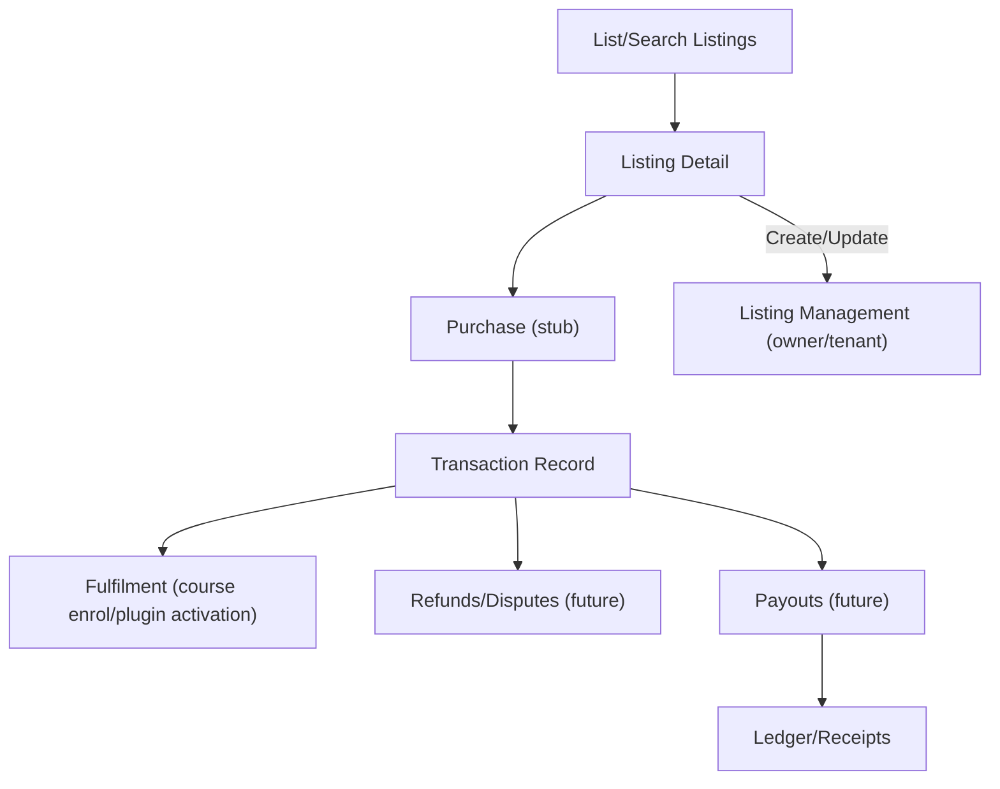

# Marketplace API (Initial)

Supports listings, purchases, and payouts (later phases).

## Endpoints (Skeleton)
- GET /api/marketplace/listings — list/search listings (courses/plugins); filters: `type`, `priceMin/priceMax`, `tenantId`, `status`; pagination `limit` default 20 (max 50), `cursor`; sort default `-updatedAt`.
- GET /api/marketplace/listings/:id — listing detail.
- POST /api/marketplace/listings — create listing (owner/tenant scope).
- PATCH /api/marketplace/listings/:id — update listing.
- POST /api/marketplace/purchase — initiate purchase (checkout stub).
- GET /api/marketplace/transactions — list user/tenant transactions; filters: `status`, `createdFrom/To`; pagination `limit` default 20 (max 50), `cursor`; sort default `-createdAt`.
- POST /api/marketplace/refunds — initiate refund (future; owner/tenant scope).
- GET /api/marketplace/payouts — list payouts (owner/tenant scope); pagination `limit` default 20 (max 50), `cursor`; sort default `-scheduledAt`.
- Example listing payload:
```json
{ "type": "course", "title": "Physics 101", "description": "Intro course", "price": 49.99, "currency": "USD" }
```
- Response example (listing create):
```json
{ "listingId": "list-1", "type": "course", "title": "Physics 101", "price": 49.99, "currency": "USD", "status": "active" }
```
- Purchase example (stub):
```json
POST /api/marketplace/purchase
{ "listingId": "list-1", "paymentMethod": "token-123" }
```
Response:
```json
{ "transactionId": "txn-1", "status": "pending" }
```

## Fields
- Listing: `id`, `type` (enum: `course`|`plugin`), `title`, `description`, `price`, `currency` (ISO 4217), `ownerTenantId`, `status` (enum: `draft`|`active`|`inactive`).
- Transaction: `id`, `listingId`, `buyerId/tenantId`, `amount`, `currency`, `status` (enum: `pending`|`paid`|`failed`|`refunded`), `paymentProviderRef`.
- Refund (future): `id`, `transactionId`, `amount`, `currency`, `status` (enum: `requested`|`processed`|`failed`), `reason`.
- Payout (future): `id`, `recipientTenantId`, `amount`, `currency`, `status` (enum: `scheduled`|`paid`|`failed`), `paymentProviderRef`.

## Validation (examples)
| Field          | Required | Type    | Constraints                                     |
|----------------|----------|---------|-------------------------------------------------|
| title          | Yes      | string  | 1–200 chars                                     |
| description    | No       | string  | 0–2000 chars                                    |
| type           | Yes      | enum    | `course` \| `plugin`                            |
| price          | Yes      | number  | >= 0; precision per currency                    |
| currency       | Yes      | string  | ISO 4217                                        |
| status         | Yes      | enum    | `draft` \| `active` \| `inactive`               |
| limit          | No       | number  | 1–50 (default 20)                               |
| cursor         | No       | string  | Token from previous page                        |
| sort           | No       | string  | Whitelist; default `-updatedAt`                 |
| media.type     | No       | string  | Allowlist: `image/png`, `image/jpeg`            |
| media.size     | No       | number  | Max 5MB per asset                               |
| media.url      | No       | string  | Must be hosted on approved CDN/storage          |
| price          | Yes      | number  | Price >= 0; currency required                   |
| taxRate        | No       | number  | 0–1 (fractional); applied per tenant/region     |
| vatIncluded    | No       | boolean | Whether price includes VAT/tax                  |

## Rules
- Auth required; enforce role/tenant scope for listing creation.
- Validate pricing/currency; structured errors.
- Payments provider integration handled in implementation; webhooks TBD.
- Consider tax/VAT handling and compliance; no sensitive payment data in logs/errors.
- Enforce status transitions (e.g., only `draft` → `active` by owner/tenant admin; refunds only on `paid`).
- Pagination: default `limit` 20, max 50; return `nextCursor`.
- Sorting: default `-updatedAt`; whitelist sort fields.
- Error example: `{ "code": "forbidden", "message": "Only tenant admins/owners can create listings" }`
- Webhooks: require HTTPS, signature verification, idempotency keys; log safely; retry with backoff on 5xx.
- Rate limiting: apply throttles on purchase/refund/listing create to mitigate abuse.
- Webhook signature (example):
  - Header: `X-Signature: sha256=<hmac>`
  - Compute HMAC over raw payload with shared secret; compare in constant time.
  - Require `Idempotency-Key` on webhooks and client purchase/refund calls to avoid duplicates.
   - Pseudo (Node/TS):
```ts
const sig = req.headers["x-signature"];
const body = rawBody;
const expected = "sha256=" + hmacSha256(secret, body);
if (!timingSafeEqual(sig, expected)) return res.status(401).json({ code: "invalid_signature" });
const idem = req.headers["idempotency-key"];
if (!idem || seen(idem)) return res.status(409).json({ code: "duplicate" });
markSeen(idem);
```

## Errors (Examples)
- 400 invalid payload: `{ "code": "invalid_request", "message": "Unsupported currency", "details": { "currency": "XYZ" } }`
- 401/403: `{ "code": "forbidden", "message": "Insufficient permissions" }`
- 404: `{ "code": "not_found", "message": "Listing not found" }`
- 502 from payment provider (surface as 502/503 with safe message).

### Error Catalog
| HTTP | Code                    | Message (example)                          | When                                        |
|------|-------------------------|--------------------------------------------|---------------------------------------------|
| 400  | `invalid_request`       | "Unsupported currency"                     | Validation failure                          |
| 400  | `invalid_filter`        | "sort must be one of: -updatedAt, price"   | Bad filter/sort                             |
| 401  | `unauthorized`          | "Authentication required"                  | Missing/invalid auth                        |
| 403  | `forbidden`             | "Insufficient permissions"                 | Role/tenant scope denied                    |
| 404  | `not_found`             | "Listing not found"                        | Unknown id                                  |
| 409  | `invalid_status_change` | "Only draft listings can be activated"     | Bad status transition                       |
| 429  | `rate_limited`          | "Too many requests"                        | If rate limiting enabled                    |
| 502/503 | `payment_provider_error` | "Payment provider unavailable"          | Upstream errors                             |
| 400  | `invalid_media`         | "Media type not allowed"                   | Disallowed media/attachments                |
| 400  | `invalid_tax`           | "Tax rate out of range"                    | Tax/VAT validation                          |
| 409  | `refund_not_allowed`    | "Only paid transactions can be refunded"   | Invalid refund request                      |
| 409  | `payout_not_ready`      | "Payout not in scheduled state"            | Invalid payout transition                   |
| 422  | `amount_mismatch`       | "Refund amount exceeds transaction total"  | Refund validation                           |

## Sample Payloads
### Create Listing
```json
POST /api/marketplace/listings
{
  "type": "course",
  "title": "Physics 101",
  "description": "Intro course",
  "price": 49.99,
  "currency": "USD",
  "status": "draft"
}
```
Response:
```json
{
  "listingId": "list-1",
  "type": "course",
  "title": "Physics 101",
  "price": 49.99,
  "currency": "USD",
  "status": "draft",
  "ownerTenantId": "tenant-1"
}
```

### Purchase (stub)
```json
POST /api/marketplace/purchase
{ "listingId": "list-1", "paymentMethod": "token-123" }
```
Response:
```json
{ "transactionId": "txn-1", "status": "pending" }
```

### Refund (future)
```json
POST /api/marketplace/refunds
{ "transactionId": "txn-1", "amount": 49.99, "currency": "USD", "reason": "Request by buyer" }
```
Response:
```json
{ "refundId": "ref-1", "status": "requested" }
```

### Payout (future)
```json
GET /api/marketplace/payouts?limit=20&cursor=abc
```
Response:
```json
{
  "items": [
    { "payoutId": "po-1", "recipientTenantId": "tenant-1", "amount": 1000, "currency": "USD", "status": "scheduled" }
  ],
  "nextCursor": null
}
```

## Future
- Refunds, payouts, tax/VAT handling, receipts, ledger/export.
- Marketplace flow diagram to be added when implementation details are set.
## Webhooks (future)
- Receive webhook notifications from payment provider for payment status, refunds, payouts.
- Validate signatures; idempotent processing; log safely.




## Tax/VAT Calculation (example)
- If `vatIncluded = true`: price is tax-inclusive; display tax breakdown in receipt.
- If `vatIncluded = false`: tax is added on top using `taxRate` or region rules.
- Sample calculation:
  - Listing price: 49.99 USD
  - vatIncluded: false
  - taxRate: 0.2
  - Total = 49.99 + (49.99 * 0.2) = 59.99 USD (rounded per currency rules)
  - Store both base and tax amounts in transaction for reporting.
