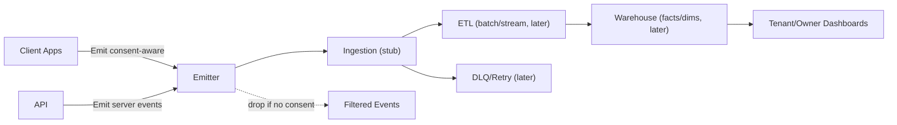

# Event Pipeline (Initial)

## Purpose
Capture user and system events for analytics, progress tracking, and future recommendations.

## Scope (Initial Phases)
- Client emitters in apps send events with locale/tenant metadata.
- Backend emits events for domain actions (auth, progress, content).
- Events are consent-aware; no PII payloads.
- Ingestion is stubbed initially; warehouse/ETL defined in Phase 0.10.

## Flow
1. Emit event from client/server with schema (name, timestamp, tenantId, locale, userId where permitted, context).
2. Optional batching on client.
3. Ingest (stub) → later routed to warehouse/analytics pipeline.

## Standards
- Follow security/compliance: no secrets/PII; honor consent toggles.
- Schema definitions live in `@platform/events` and analytics docs when implemented.

## Future
- Phase 0.10 introduces warehouse schema, ETL plan, and dashboards.
- Recommendations and knowledge graph consume events in later phases.

