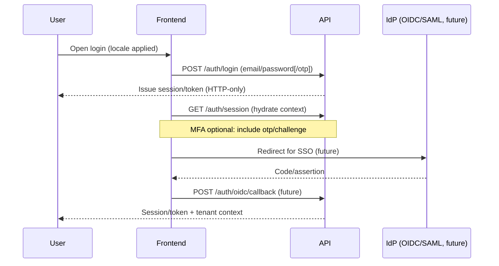
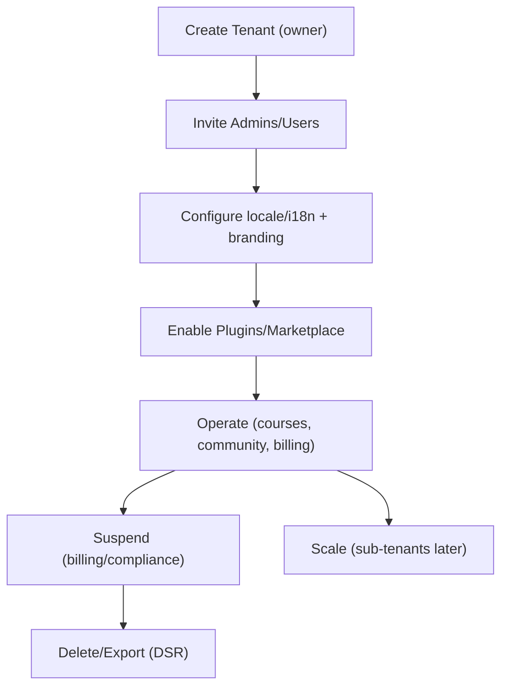

# Architecture Overview

This document provides a high-level architectural description of the platform.  
It defines the major subsystems, their responsibilities, and how they interact.  
All other architectural documents reference this overview.

The platform is a multi-tenant, modular, extensible learning and creation system consisting of:

- A custom CMS  
- A lesson/course engine  
- A unified dashboard shell (persistent layout)  
- Public profiles for users (badges, certificates, portfolios)  
- A community subsystem (forums, collaboration, projects)  
- A multi-tenant SaaS model  
- A plugin & extension platform  
- A behavioural analytics pipeline  
- A developer API + knowledge graph layer  
- A workspace environment for interactive content  
- A global discovery library (featured tenant courses)  
- A STEM/CS-focused interactive toolkit (math/chem/physics/biology/code), featured in the library
- A flexible role/permission system (owner, site admin, tenant/tenant admin, developer/plugin developer, author, student; future course/module roles)

## Role Set (Current)
- Owner (platform)
- Site Admin (platform ops/moderation)
- Tenant, Tenant Admin (tenant management)
- Developer/Plugin Developer
- Author/Creator
- Student
- Future: Sub-tenant roles, Course/Module Conveners, Instructor, Moderator

This overview describes the major domains and how they fit together.

---

# 1. Platform Goals

The system is designed to:

1. Allow creators (tenants) to build courses, lessons, and interactive content using a custom CMS.
2. Store content in an external headless store (Sanity or equivalent) for cost efficiency.
3. Provide a multi-tenant LMS experience for students and organisations.
4. Provide a **unified dashboard shell** with:
   - persistent header  
   - dynamic left & right sidebars  
   - consistent UX across LMS, CMS, Admin, Library & Dev Portal  
5. Provide **public user profiles** that contain:
   - badges  
   - certificates  
   - course history (optional)  
   - user portfolios  
   - social links  
   - showcase of completed community projects  
6. Provide **community features** including:
   - forums  
   - collaborative projects  
   - group discussions  
   - team workspaces  
   - creator ↔ student interactions  
   - tenant-wide or global communities  
7. Support complex user roles that may overlap across contexts:
   - student  
   - tenant  
   - instructor  
   - developer  
   - admin  
   - platform owner  
8. Provide a plugin ecosystem enabling third-party extensions.
9. Provide analytics and behavioural tracking for tenants and the platform.
10. Support marketplace-style discovery and revenue sharing.
11. Support future features such as:
   - workspace environments (coding IDE, math tools, simulations)
   - knowledge-graph-driven recommendations
   - developer storefront for plugins/extensions

This platform is intended to be foundational, modular, and extensible.

---

# Auth / SSO Flow (High-Level)

---

# Tenant Lifecycle (High-Level)

---

# 2. High-Level System Architecture

The system consists of three primary layers:

---

## 2.1 Applications (Apps Layer)

- Unified Dashboard Shell (persistent layout)
- LMS App (student-facing)
- CMS App (creator/tenant-facing)
- Admin/Owner Dashboard
- Public Discovery Library (course browsing)
- Developer Portal
- Public Profiles
- Community App (forums, collaboration spaces, projects)
- Authentication pages
- Marketing/public site

---

## 2.2 Core Backend Services (API + Domain Logic Layer)

Backend responsibilities include:

- User management  
- Public profile management  
- Tenant management  
- Role & permission binding  
- Forums & community features  
- Course/lesson lifecycle  
- Progress tracking  
- Badge & certificate issuance  
- Plugin registration & execution  
- Analytics ingestion  
- Entity system (universal resource abstraction)  
- Event system  
- Workspace/project collaboration engine  
- Developer API  

---

## 2.3 Shared Infrastructure Layer (Packages Layer)

Shared modules include:

- `@platform/types`
- `@platform/utils`
- `@platform/auth`
- `@platform/permissions`
- `@platform/entities`
- `@platform/events`
- `@platform/analytics`
- `@platform/ui` (UI kit + components)
- `@platform/layout` (unified dashboard shell)
- `@platform/content` (content engine)
- `@platform/community` (forum and collaboration primitives)
- `@platform/profile` (public profile primitives)

---

# 3. Unified Dashboard Shell

The unified dashboard is the persistent container for the authenticated user experience.

It consists of:

### 3.1 Header  
- global navigation  
- tenant switcher  
- notifications  
- account menu  

### 3.2 Left Sidebar  
- contextual navigation based on:
  - current app (LMS, CMS, Admin, Dev Portal, Community)
  - current entity (course, tenant, workspace, forum)
  - user roles  

### 3.3 Right Sidebar  
- contextual tools, such as:
  - progress overview  
  - analytics snapshots  
  - participants / collaborators  
  - active plugins  
  - companion tools (notes, discussion threads, resources)

### 3.4 Main Content Area  
All app content renders here.

The shell persists across the entire main experience except:
- auth flows  
- marketing pages  
- optional full-screen workspace modes  

# 3.5 Localisation & Internationalisation

- Users and tenants store preferred language/locale in settings; the dashboard includes a language switcher.
- UI strings come from shared translation catalogs; date/number formatting respects locale.
- Content supports locale-specific fields or translations where needed.
- Defaults and fallback locales are documented per app and package.

# 3.6 Accessibility & Compliance

- UI follows WCAG 2.1 AA as a baseline: keyboard navigation, focus management, screen reader semantics, and contrast-safe palettes.
- Components/layouts in the shared UI kit enforce accessible patterns.
- Compliance (e.g., GDPR/CCPA): consent tracking where applicable, data minimisation, deletion/export workflows, and audit logging are planned and documented with data/API design. See `docs/standards/compliance-standard.md` for requirements.

# 4. Multi-Tenant Architecture
# 4. Multi-Tenant Architecture

The platform supports first-class multi-tenancy:

- Single database schema with tenant isolation  
- Per-tenant roles & permissions  
- Per-tenant content  
- Tenant-level analytics  
- Tenant-level plugin configuration  
- Tenant-level community sections (optional isolation)  

Users may switch tenants via the unified dashboard.

---

# 5. Public Profiles

Public profiles are accessible outside the unified dashboard.

A profile includes:

- Display name & avatar  
- Bio  
- Social links  
- Personal website/portfolio  
- Achievements:
  - badges
  - certificates
  - completed courses  
- Public projects (from the Community subsystem)  
- Followers/following (future)
- Plugin developer identity (optional role)
- Public activity (curated, privacy-first)

Profiles are customisable and shareable via unique URLs.

---

# 6. Community Subsystem

The community layer allows users to interact, collaborate, and engage socially within the platform.

## 6.1 Forums  
- topic-based discussion boards  
- tenant-scoped or global  
- moderation tools  
- role-based posting permissions  
- threaded discussions  
- plugin-injectable widgets  

## 6.2 Collaborative Projects  
- shared workspaces  
- group project structure  
- file/media uploads (local or external)  
- project roles  
- task lists  
- activity feed  
- submissions and grading (for LMS integration)  

## 6.3 Community Spaces  
- tenant communities  
- global interest-based communities  
- optional plugin-provided spaces  

## 6.4 Integration Points  
Community features integrate with:

- unified dashboard (navigation + right sidebar modules)
- public profiles (profile shows public projects)
- analytics (engagement → recommendations)
- content engine (projects may include blocks)
- plugin system (to extend community features)

---

# 7. Entity System

A universal entity model unifies resources like:

- users  
- tenants  
- courses  
- modules  
- lessons  
- forums  
- threads  
- posts  
- collaborative projects  
- workspace sessions  
- profile achievements  
- plugins  
- analytics events  

Useful for:

- permissions  
- analytics  
- plugin system  
- knowledge graph  

See:

`/docs/architecture/entity-system.md`

---

# 8. Permission System

Role → binding → entity.

Examples:

- A user may be:
  - a student in Tenant A
  - an instructor in Tenant B
  - a developer globally
  - a moderator in a forum
  - a collaborator in a project

Permissions power:

- UI gating  
- API gating  
- community moderation  
- LMS limitations  
- CMS controls  
- dashboard visibility  

---

# 9. Content Engine

Supports:

- courses, modules, lessons  
- interactive components  
- subject-specific block types  
- YouTube + media embeds  
- external storage integration  
- versioning, drafts, publishing  

Renders inside the unified dashboard’s main area.

---

# 10. Plugin System

### 10.1 Platform Plugin Management
Handles:
- registration  
- activation  
- extension points  
- permission scopes  
- configuration  
- dashboard sidebar injections  
- community extensions (forum widgets, project templates)

### 10.2 Developer API
Allows third-party developers to build:
- custom blocks  
- LMS features  
- CMS tools  
- community widgets  
- dashboard extensions  
- workspace tools  
- analytics pipelines  

Plugins run in a controlled sandbox.

---

# 11. Analytics & Behavioural Tracking

Tracks:

- user engagement  
- course progress  
- community activity  
- plugin usage  
- tenant performance  

Feeds into:

- dashboards  
- discovery library rankings  
- knowledge graph inference  
- recommendations  
- developer analytics  

---

# 12. Knowledge Graph (Future)

Connects:

- users ↔ courses ↔ lessons ↔ concepts  
- community projects ↔ collaborators  
- plugin developers ↔ plugin consumers  
- forum discussions ↔ knowledge topics  

Used for:

- recommendation engines  
- personalisation  
- relevance ranking  
- semantic content suggestions  

---

# 13. Workspace Environment (Future)

Interactive sandbox environments for:

- coding IDEs  
- math engines  
- science lab simulations  
- creative tools  
- collaborative realtime apps  

Integrates with projects, courses, plugins, and the unified dashboard.

---

# 14. Discovery Library

A central content browsing system:

- featured tenant courses  
- trending learning paths  
- recommended content  
- category and tag navigation  
- search  
- rich filtering  

Public and unified dashboard variants.

---

# 15. Revenue, Payments & Marketplace (Future)

Supports:

- paid courses  
- subscription options  
- revenue splits  
- marketplace plugins  
- payouts  
- financial dashboards  

Built later.

---

# 16. Phased Development

The platform follows a strict development roadmap documented at:

`/docs/architecture/development-outline.md`

The unified dashboard, CMS, community system, and core LMS form the backbone of early development phases.

---

# 17. Summary

This platform is:

- multi-tenant  
- modular  
- extensible  
- community-enabled  
- social  
- analytics-powered  
- knowledge-driven  
- content-centric  
- plugin-friendly  
- built around a persistent, unifying dashboard shell  
- designed for creators, students, developers, and organisations  

This architecture overview defines the conceptual boundaries.  
Detailed architectural documents expand on each subsystem.

---

**End of Architecture Overview**
