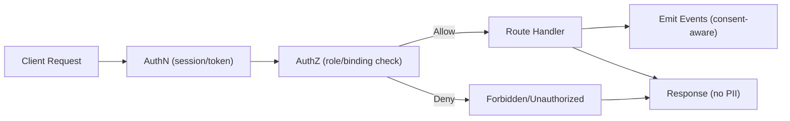
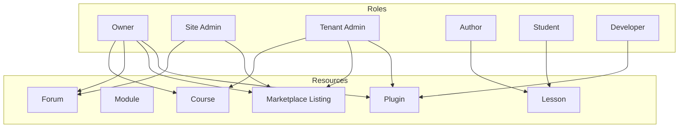

# Permission System (Initial)

## Purpose
Define role- and permission-based access control across entities and apps.

## Roles (initial)
- Owner (platform)
- Site Admin (platform ops/moderation)
- Tenant (generic tenant user)
- Tenant Admin (tenant-level management)
- Developer/Plugin Developer
- Author/Creator (tenant)
- Student
- Future: Sub-tenant roles, Course Convener, Module Convener, Instructor, Moderator, additional specialty roles as needed.

## Model
- Roles bind to entities (e.g., user is `student` on course/tenant, `author` on content).
- Permissions derive from role + entity context; evaluated per request.
- Tenant scoping introduced in later phases; include `tenantId` when available.

## Enforcement
- Backend: middleware/guards on API routes; deny with structured errors.
- Frontend: UI gating (disabled/hidden/forbidden states) and navigation visibility.
- Audit logging for permission changes.

## Sample Permissions (initial)
- Student: view published lessons; enrol/unenrol; update own progress; view community.
- Author: create/edit courses/modules/lessons/blocks; publish/unpublish; view progress of own content (later).
- Tenant Admin: manage tenant content; manage enrolments; activate plugins (if allowed); moderate community.
- Owner: platform-level settings; plugin registry; marketplace moderation; tenant management.
- Site Admin: platform operations/moderation; assist owner; no ownership of tenant content unless delegated.
- Developer/Plugin Developer: register plugins, manage manifests; limited to dev/tenant scopes unless elevated.

## Permission Matrix (Initial Examples)
| Action                      | Student | Author | Tenant Admin | Owner |
|-----------------------------|---------|--------|--------------|-------|
| Enrol in course             | Yes     | Yes    | Yes          | Yes   |
| View published lesson       | Yes     | Yes    | Yes          | Yes   |
| Edit lesson                 | No      | Yes    | Yes          | Yes   |
| Publish/unpublish lesson    | No      | Yes    | Yes          | Yes   |
| Manage enrolments           | No      | No     | Yes          | Yes   |
| Moderate forums/posts       | No      | No     | Yes (if scoped) | Yes |
| Activate plugins            | No      | No     | Yes (tenant-scoped) | Yes |
| Access owner dashboards     | No      | No     | No           | Yes   |

## Permission Matrix (Community/Marketplace, Initial)
| Action                        | Student | Author | Tenant Admin | Owner | Site Admin | Developer |
|-------------------------------|---------|--------|--------------|-------|------------|-----------|
| Create forum thread/post      | Yes     | Yes    | Yes          | Yes   | Yes        | No        |
| Moderate forum content        | No      | No     | Yes (if scoped) | Yes | Yes        | No        |
| View profiles                 | Yes     | Yes    | Yes          | Yes   | Yes        | No        |
| Create marketplace listing    | No      | No     | Yes (tenant content) | Yes | No    | No        |
| Moderate marketplace          | No      | No     | No           | Yes   | Yes        | No        |
| Register/manage plugins       | No      | No     | Limited (tenant-allowed) | Yes | Yes | Yes (manifest/registry) |
| Platform moderation (site admin) | No    | No     | No           | Yes   | Yes        | No        |
| Access owner dashboards       | No      | No     | No           | Yes   | Yes        | No        |

## Future Roles (planned definitions)
- Course Convener / Module Convener / Instructor: scoped authoring and moderation rights to specific courses/modules; can view/grade progress for their scope; no tenant/owner admin powers unless delegated.
- Sub-tenant Admin/Member: mirrors tenant roles but restricted to sub-tenant boundaries; cannot affect parent tenant configuration.
- Moderator: forum/community moderation within assigned forums; cannot change tenant settings.

## Permission Matrix (Extended/Future Examples)
| Action                               | Convener/Instructor | Moderator | Sub-tenant Admin | Sub-tenant Member |
|--------------------------------------|---------------------|-----------|------------------|-------------------|
| Create/edit lessons (scoped)         | Yes (scoped)        | No        | Yes (within sub-tenant) | Yes (own drafts) |
| Publish/unpublish (scoped)           | Yes (scoped)        | No        | Yes (sub-tenant scope) | No |
| View/grade learner progress (scoped) | Yes (scoped)        | No        | Yes (sub-tenant) | Own only |
| Moderate forums (assigned forums)    | Yes (scoped)        | Yes (assigned) | Yes (sub-tenant forums) | No |
| Manage enrolments (scoped)           | Yes (scoped)        | No        | Yes (sub-tenant) | No |
| Manage plugins/listings              | No                  | No        | Limited (sub-tenant plugins) | No |

## UI Gating Patterns
- Nav items: hide/disable based on role (e.g., owner/admin nav vs student nav).
- Actions: disable buttons when forbidden; show clear messaging; never expose actions that cannot be performed.
- Data: only fetch/shape data allowed for role; avoid leaking counts/details for unauthorized entities.

## Expansion/Integration Plan
- Define new role bindings as roles are introduced; update matrices and entity bindings alongside feature work.
- Keep UI gating in sync with backend rules; add feature flags for future roles before rollout.
- Add per-role smoke tests (UI and API) when endpoints exist.

## Integration
- Uses entity system for consistent IDs/types.
- Aligns with enrolment/progress for content access; community actions scoped by role.

## Future
- More granular scopes; SSO/MFA impacts; per-tenant configs in multi-tenant phase.
