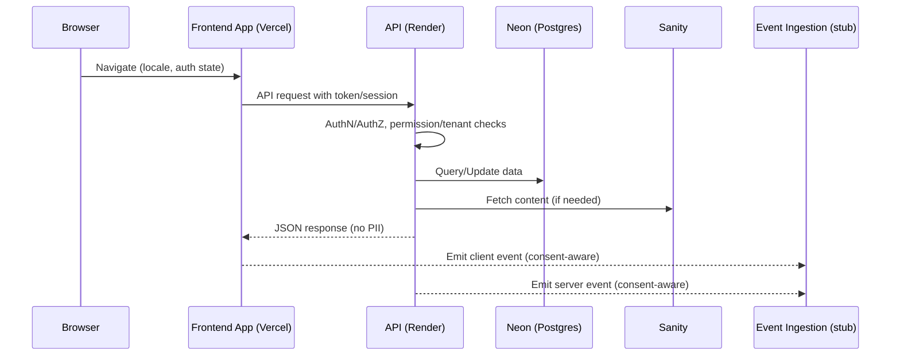
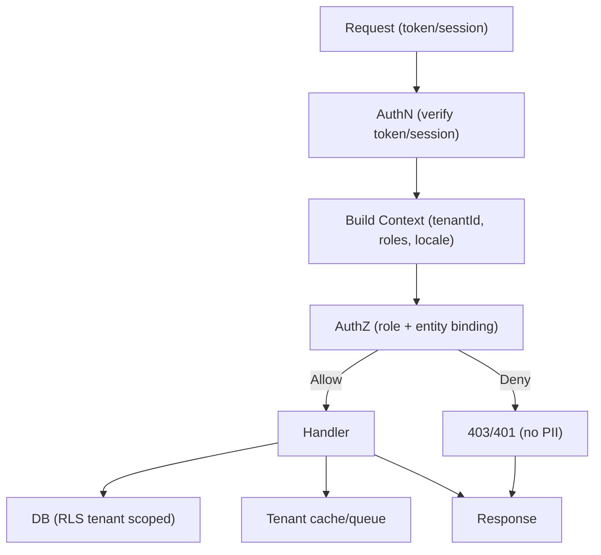
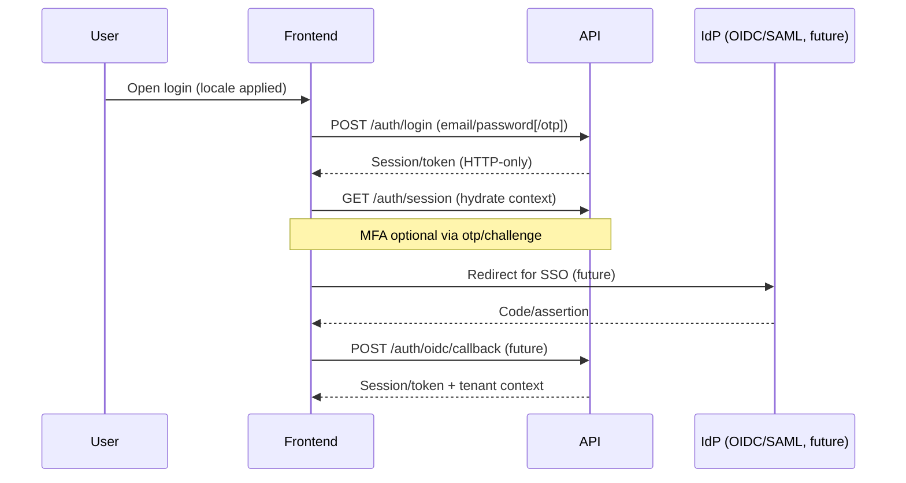

# Request Flow (High-Level)

## Backend (Node/Express)
1. Request enters API gateway/backend.
2. AuthN/AuthZ: validate session/token; enforce permissions/tenant scope.
3. Route handling: validate input; execute domain logic.
4. Data access: Neon (Postgres) for structured data; Sanity for content retrieval.
5. Emit events (consent-aware) for analytics/progress where applicable.
6. Respond with structured payloads; errors follow error-handling standard (no sensitive data).

## Frontend (Apps)
1. User navigates via unified shell; locale/tenant context applied.
2. Fetch data via API client; handle loading/error/empty states; externalise all strings via i18n.
3. Render with shared UI kit/layout; apply a11y patterns.
4. Emit client events for analytics (stubbed initially) with locale/tenant metadata.

## Multi-Tenancy & Plugins (Later Phases)
- Tenant switcher influences API calls and UI context.
- Plugin extension points may augment request/response behavior in a controlled sandbox.

## Notes
- All flows must avoid PII in logs; follow security/compliance/error-handling standards.

