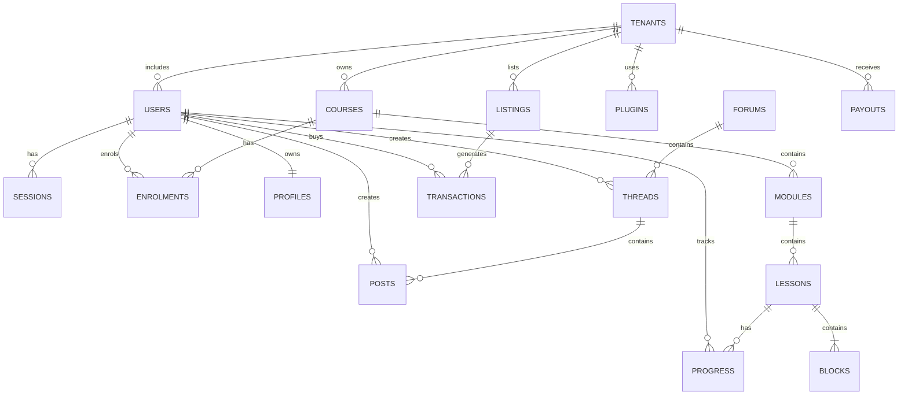

# ERD (Text Outline)

Entities and key relationships (initial phases):

- Users 1—* Sessions
- Users *—* Courses via Enrolments
- Users 1—1 Profiles
- Tenants 1—* Users (later)
- Tenants 1—* Courses (later)
- Courses 1—* Modules
- Modules 1—* Lessons
- Lessons contain Blocks (jsonb)
- Users *—* Lessons via Progress (course/module/lesson scope)
- Forums 1—* Threads 1—* Posts (created_by Users)
- Tenants 1—* Plugins (when tenant-bound)
- Listings 1—* Transactions (later)
- Tenants 1—* Listings (owner) (later)
- Tenants 1—* Payouts (later)

Note: Multi-tenant relationships expand in later phases; ensure tenantId is included where required.***

Note: Diagram is simplified; tenant relationships are introduced in later phases.

## Optionality/Constraints
- Tenant links are introduced in multi-tenant phases; until then, tenantId may be null.
- Block content stored as jsonb; validate structure in backend.
- Enrolments required for progress updates; enforce FK integrity.
- Status fields are enums; see tables/schemas for allowed values.
- Indexes/uniques noted in tables; ensure order uniqueness for modules/lessons.***

## Tenant Lifecycle Notes
- Tenant creation: set defaultLocale; owner bindings; seed settings; capture consent/versioned policies.
- Suspend: block logins/API for tenant context; keep data for billing/export; emit audit event.
- Delete/Export: fulfill DSR by exporting tenant-scoped data (courses, community, listings, profiles) and purging per retention rules; propagate to caches/warehouse.
- RLS: when multi-tenant is enabled, enforce row-level security on tenant-scoped tables and include `tenantId` in all FK relations and queries.

## Key Attributes (Summary)
- Users: id (uuid), email (unique), passwordHash, name, locale, createdAt/updatedAt
- Tenants: id (uuid), name, defaultLocale, createdAt/updatedAt
- Sessions: id, userId, expiresAt, createdAt
- Courses: id, title, description, status (draft|published), locale, tenantId?, createdAt/updatedAt
- Modules: id, courseId, title, orderIndex, createdAt/updatedAt
- Lessons: id, moduleId, title, status, orderIndex, locale, blocks (jsonb), createdAt/updatedAt
- Enrolments: id, userId, courseId, status (active|unenrolled), createdAt/updatedAt
- Progress: id, userId, courseId, moduleId?, lessonId?, status, percentComplete, lastAccessedAt, createdAt/updatedAt
- Forums/Threads/Posts: ids, foreign keys, titles/body, createdBy, timestamps
- Profiles: userId, displayName, bio, socialLinks, timestamps
- Plugins: id, name, version, scopes, manifestUrl, activated, tenantId?, timestamps
- Listings/Transactions/Payouts (later): pricing/currency/status fields, tenant/user references, timestamps

Optional fields (`?`) are introduced as multi-tenant features roll out.***
