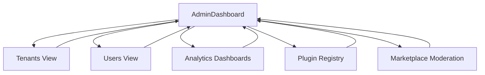

# Admin/Owner App

## Scope
Admin/owner-facing application for platform oversight: users/tenants, analytics, marketplace moderation, and settings.

## Core Flows (early phases)
- Dashboard with role-based modules/cards.
- Tenant/User views (read-only initially); manage plugin registry entries (later).
- Access analytics dashboards (once available); view settings/compliance info.
- Locale switcher; externalised strings; a11y applied.

## UX & States
- Role-based visibility for modules/actions; forbidden states shown clearly.
- Loading/error/empty states for lists/cards; retry paths.
- Responsive design; use layout/UI kit; no ad-hoc styling.

## Permissions/Security
- Owner/admin-only actions; enforce permission checks; audit-sensitive actions noted.
- Prep for SSO/SAML controls in later phases.

## Integration
- Uses UI kit/layout/i18n.
- APIs: tenants/users (when exposed), plugin registry, analytics dashboards, marketplace moderation (later).
- Telemetry: emit events for admin actions (consent-aware); avoid PII in logs/errors.

## Future
- Full tenant/user management, moderation tools, revenue reporting, plugin marketplace moderation, enterprise auth controls, compliance dashboards.***
