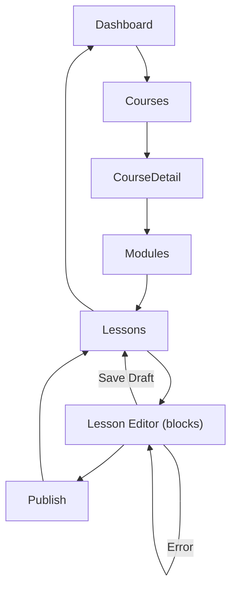

# CMS App

## Scope
Creator/tenant-facing application for authoring and managing courses/modules/lessons, including interactive STEM/CS blocks.

## Core Flows (early phases)
- Course/Module/Lesson management: create/read/update/delete with ordering.
- Editor: block picker (text, media/YouTube, math, chem, physics/bio visuals, code sandbox, custom placeholders), reorder, delete.
- Draft/Publish: explicit status controls; publish/unpublish endpoints; publish confirmation and feedback.
- Locale handling: select lesson locale; show locale on blocks; fallbacks documented.
- Enrolment controls (optional): allow/deny enrolment; link to enrolment APIs.

## UX & States
- States: loading/error/empty for lists and editor; autosave optional later.
- Validation: inline per field/block; consolidated form errors on save/publish; prevent double submits.
- Permissions: surface forbidden states (disable/hide actions) based on role/binding; show clear messaging.
- A11y/i18n: all labels/help/errors from i18n; focus management; keyboard support for block operations; aria on form fields and controls.
- Responsive: layouts adapt to mobile/desktop; use UI kit/layout primitives; avoid fixed widths.

## Interactive Blocks
- Math/LaTeX: render preview; validate expression.
- Chemistry: formula/structure inputs; preview if available.
- Code sandbox: language selector, code editor area, sandbox config (timeout/readonly); no network by default.
- Media/YouTube: URL entry with provider validation; caption field.
- Safety: sanitize embeds; sandbox code; enforce limits per block type.

## Navigation & Shell
- Lives inside unified shell; uses shared nav/sidebar/footer.
- Locale switcher in shell; CMS respects current locale.
- Course/module/lesson views accessible from CMS nav; returns to dashboard shell cleanly.

## Integration
- Uses UI kit, layout, i18n packages.
- APIs: Content (CRUD, publish), Enrolment (if exposed), Events (emit authoring/preview events), Permissions (gating).
- Telemetry: emit consent-aware events for create/update/publish/block usage with locale/tenant metadata.

## Future
- Versioning/history, collaboration, plugin-provided blocks, richer workflows (review, scheduling), assessments, media asset management.***
