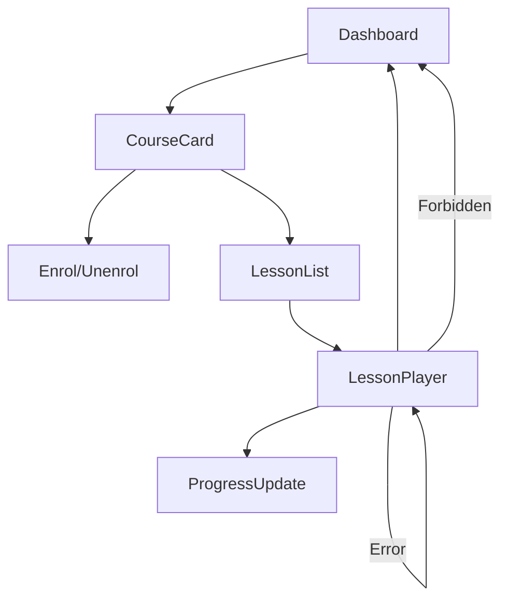

# LMS App

## Scope
Student-facing application for discovery, enrolment, lesson playback (including interactive toolkit), and progress tracking.

## Core Flows (early phases)
- Discovery/Dashboard: show enrolled course cards with status/progress; allow enrol/unenrol; link to lessons.
- Lesson Playback: render blocks (text, media, math/chem visuals, code sandbox, etc.) with safe defaults.
- Progress: display/update progress indicators; handle loading/error/empty states.
- Locale handling: UI strings externalised; locale switcher via shell; content localisation applied.

## UX & States
- States: loading/error/empty/forbidden; retries where appropriate.
- Permissions: hide/disable actions when not enrolled/authorized; clear messaging.
- A11y/i18n: focus management, keyboard navigation, aria for controls; all copy via i18n.
- Responsive: layouts adapt to mobile/desktop; use UI kit/layout primitives.

## Interactive Blocks
- Render interactive toolkit blocks safely (sandbox code, sanitize embeds, validate math/chem).
- Provide minimal controls (run/play) with feedback; handle errors gracefully.

## Navigation & Shell
- Lives in unified shell; nav/sidebar to courses/modules/lessons/community; footer links.
- Locale switcher present; respects tenant context when added.

## Integration
- Uses UI kit, layout, i18n packages.
- APIs: Content (read), Enrolment (enrol/unenrol/list), Progress (read/update), Events (emit view/progress/interaction), Permissions (gating).
- Telemetry: emit consent-aware events with locale/tenant metadata; include interactive usage.

## Future
- Recommendations surfaces, community integration, workspace entry points, marketplace tie-ins, richer dashboards.***
