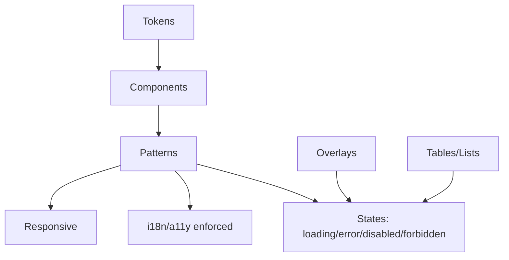

# UI Kit

## Purpose
Provide shared components and design tokens for all apps, enforcing consistency, i18n, accessibility, and theming/tenant overrides.

## Design Tokens
- Color: base palette (neutral, primary, success, warning, danger), semantic tokens (surface, text, border, focus). Support theme overrides and tenant branding.
- Typography: scale (xs–xl), font stacks, line-height, font-weight tokens.
- Spacing: consistent scale for padding/margins/gaps.
- Radii/shadows: tokens for shape depth; avoid ad-hoc values.
- Motion: duration/easing tokens for focus/hover/entrance.

## Components (initial)
- Inputs: text, textarea, select, checkbox, radio, toggle.
- Buttons: primary/secondary/tertiary/destructive; loading/disabled states.
- Forms: field wrappers, labels, helper/error text; validation patterns.
- Feedback: Alerts/Toasts (success/info/warning/error).
- Navigation: nav items, tabs, breadcrumbs, sidebar/header items.
- Layout: grid/flex primitives, stack/cluster utilities, cards.
- Overlay: Modals/Drawers (focus trap, aria-labelled), dropdowns/menus.
- Data: Tables/lists (basic), badges/chips, progress indicators.

## Guidelines
- i18n: no hardcoded strings; all labels/help/errors from shared i18n.
- Accessibility: labels/aria for form fields, focus outlines using tokens, keyboard navigation, proper roles for overlays/menus.
- States: loading/error/disabled/forbidden handled consistently with semantic colors and messaging.
- Responsive: components adapt to mobile/desktop; avoid fixed widths; use layout primitives.
- Theming: consume tokens; allow tenant overrides via theme hooks; never inline brand colors.
- Composition: favor controlled components; expose minimal props; avoid prop drilling business logic.
- Cross-app wiring: ensure layout/ui/i18n packages are the source of truth; avoid app-specific forks of components or ad-hoc a11y patterns.

## Patterns
- Forms: show validation inline; on submit, show consolidated errors; prevent double-submit; keep assistive text tied to inputs.
- Buttons/Links: use correct semantics (button vs link); disable vs forbidden messaging per permission system.
- Overlays: focus trap, return focus on close; ESC and click-outside handling; aria-modal.
- Tables/Lists: support empty/error/loading states; row focus/keyboard nav; avoid layout thrash on pagination.
- Auth/Settings UX: login/signup/reset forms must include labels/aria, focus order, keyboard nav, error summaries; locale switcher and consent/notice strings drawn from shared i18n; show non-revealing errors for auth flows.

## Integration
- Used by all apps; aligns with layout package, i18n provider, and permission gating patterns.
- Acts as base for plugin-provided UI extensions; ensure extension slots use same tokens and a11y/i18n conventions.
