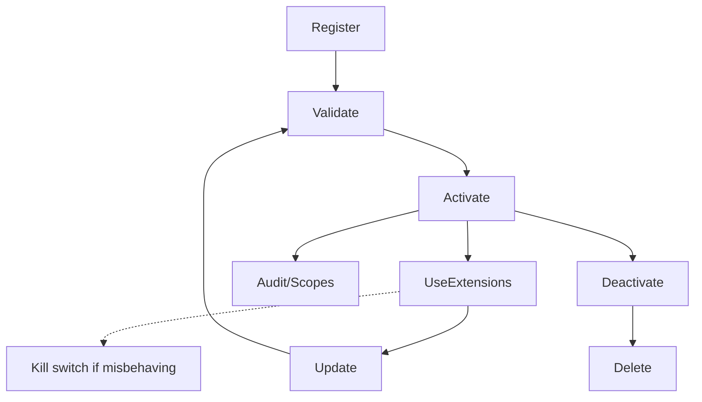

# Plugin System Overview

## Purpose
Enable controlled extensibility via third-party or tenant-provided plugins while protecting security, privacy, and UX consistency.

## Architecture
- Registry: stores manifests, versions, scopes, activation state, tenant bindings.
- Sandbox runtime: isolates plugin execution; exposes limited APIs/events per scope (stub initially).
- Extension points: content blocks, dashboard sidebars, community widgets (initial); expand later.
- Management UI: register/activate/deactivate plugins; view scopes/data disclosures.

## Manifests
- Declare name/version, extension points, required scopes/permissions, configuration schema, manifest URL/config, author info, data access disclosure.
- Versioned; validated on register/update; reject undeclared scopes.

## Activation & Configuration
- Owner/admin registers plugins; tenant admins activate/deactivate for their tenants (when allowed).
- Tenant scoping enforced; per-tenant configuration stored separately; defaults documented.

## Security/Compliance
- Sandbox execution with resource/network limits; no unscoped access.
- Strict scope enforcement; consent-aware data access; audit logging for registry actions.
- UI extensions must use shared UI kit/i18n/a11y patterns.
- Kill switch/runbook: ability to disable a plugin globally or per tenant on repeated errors or policy violations; log incident and notify admins; document recovery steps.

## Future
- Richer SDK/runtime, marketplace distribution, signing/verification, extension point expansion.
- Resource limits and observability for plugins; kill-switches and audit trails.
- Deployment lifecycle (register → validate → activate → update → deactivate → delete) to be documented alongside sandbox/policies.

