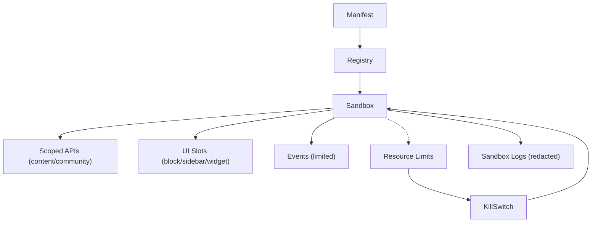

# Plugin Development API (Stub)

## Purpose
Describe the runtime APIs available to plugin developers in the sandbox (groundwork; full SDK later).

## Runtime Surface (initial/stub)
- Events: subscribe to allowed events (limited set per scope).
- APIs: limited read/write per scopes (e.g., `content.read`, `content.block.render`, `community.widget`).
- UI: render components in declared extension points (content block, dashboard sidebar, community widget) using shared theming/i18n/a11y conventions.
- Storage (future): ephemeral key/value per tenant/plugin with quotas; no cross-tenant sharing.

## Scopes
- Declared in manifest; enforced strictly.
- Examples: `content.read`, `content.block.render`, `community.widget`, future `analytics.emit` (if allowed).
- Scope validation examples:
  - `content.block.render` can only read course/module/lesson metadata for the context provided by the host.
  - `community.widget` limited to forum/thread IDs passed in; cannot query arbitrary tenants.

## Security
- Sandbox execution with resource/network limits; no unrestricted access.
- Data access limited to declared scopes; consent-aware; audit registry actions.
- Input/Output validation:
  - Enforce schema on props passed to plugins; reject unexpected keys.
  - Plugin responses must be serializable; reject functions/closures.
  - Size/time caps per render; kill-switch triggers on repeated violations.

## Future
- Full SDK with lifecycle hooks, richer APIs (analytics, storage), testing harness, publishing guidelines.***


## Example Manifest Snippet (stub)
```json
{
  "name": "lesson-enhancer",
  "version": "0.1.0",
  "scopes": ["content.read", "content.block.render"],
  "extensionPoints": [
    { "type": "content.block", "component": "LessonEnhancer" }
  ]
}
```

## Testing (future)
- Provide local sandbox harness to validate scopes, payload sizes, and render output.
- Include sample events and mock host props for block/dashboard extensions.
