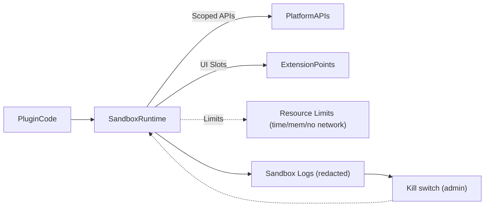

# Sandbox API (Stub)

## Purpose
Define the runtime interface available to plugins in a sandboxed environment, enforcing scope and isolation.

## Capabilities (initial/stub)
- Read-only access to allowed data via scoped APIs (content read, limited user/context).
- UI render hooks for extension points (content block, dashboard sidebar, community widget) using shared theming/i18n.
- Event subscription for allowed events.
- Example allowed calls (stub):
  - `content.getLesson({ lessonId })` when scope includes `content.read`.
  - `ui.renderBlock(props)` within declared block extension using provided React host.
  - `events.subscribe('progress.update', handler)` when scope includes `analytics.read` (future).

## Restrictions
- No unrestricted network/file/system access.
- Resource limits (time/memory); no long-running tasks; no unapproved outbound calls.
- Data access constrained by manifest scopes and tenant context; consent-aware.
- Observability: log sandbox errors with redaction; support kill-switch to disable misbehaving plugins.
- Suggested limits (initial): execution timeout (e.g., <2s for UI renderers), memory cap (lightweight), no outbound network unless explicitly allowed by scope.
- Validation rules:
  - Reject plugin responses exceeding size caps (e.g., 64KB UI payload).
  - Require explicit return shape: `{ type: "render", body: ... }` or `{ type: "error", code, message }`.
  - Strip/escape HTML to prevent XSS; enforce CSP in host app.

## Errors/Responses (examples)
- Success (UI render): `{ "type": "render", "body": { "blocks": [...] } }`
- Forbidden scope: `{ "type": "error", "code": "forbidden_scope", "message": "Scope content.read not granted" }`
- Timeout: `{ "type": "error", "code": "timeout", "message": "Execution exceeded limit" }`
- Validation failure: `{ "type": "error", "code": "invalid_payload", "message": "Unexpected key 'foo'" }`

## Callbacks/Observability
- Host → sandbox callbacks must be signed (or same-process) and idempotent.
- Log plugin execution with redaction; emit metrics on failures/timeouts to drive kill-switch automation.

## Future
- IPC/proxy model for plugin calls; monitoring/kill-switches; storage quotas; more extension points.***

