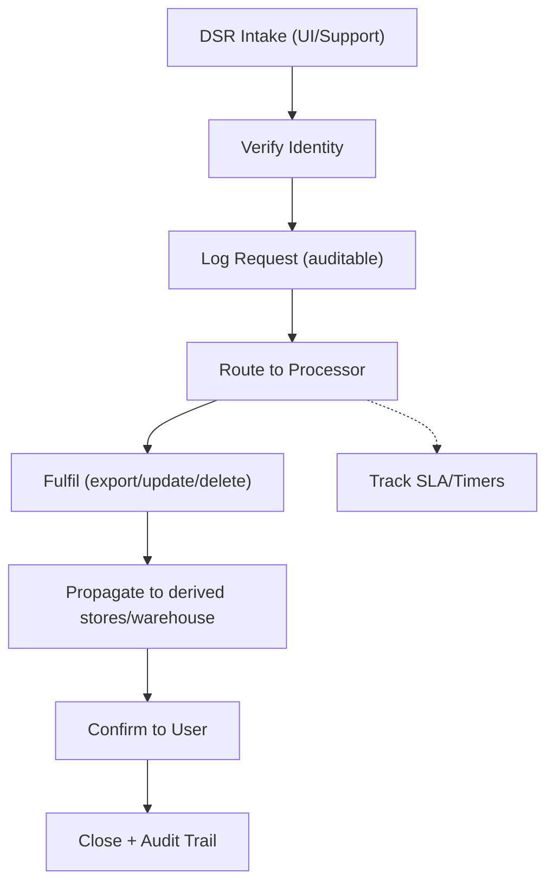

# Compliance Standard (Privacy, Data Protection & Consent)

This standard defines the minimum privacy and data protection requirements (e.g., GDPR, CCPA) for the platform. All features and data flows MUST adhere to this document.

## 1. Scope
- Applies to all apps, services, packages, data stores, logs, and analytics.
- Covers personal data (PII) and sensitive data collected via the platform or plugins.

## 2. Consent & Notice
- Obtain explicit consent where required (tracking, marketing, cookies). Record consent version, timestamp, and locale.
- Provide clear privacy notices in the user’s preferred language.
- Honour opt-out for analytics/marketing where applicable.
- Auth/Settings placements (0.2+): show consent/notice on signup; link from login; surface consent/version and analytics opt-in toggles in settings. Persist consentVersion/consentGivenAt; default analytics to off unless explicitly enabled. Provide locale-aware notice text pulled from shared i18n bundles.

## 3. Data Subject Rights (DSR)
- Support access/export (portable format), rectification, and deletion requests.
- Respect “do not sell/share” flags for applicable jurisdictions.
- Provide an auditable trail of DSR requests and fulfillment.
- Workflow (to operationalise in phases 0.4/0.7):
  - Intake (UI or support) → verify identity → log request with locale/time → route to processor (API) → fulfill within SLA → confirm to user → audit trail stored.
  - If data spans analytics/warehouse, ensure deletion/export propagates to derived stores and backups per retention.

## 4. Data Minimisation & Purpose Limitation
- Collect only what is needed for the stated purpose; document purposes per data field where possible.
- Avoid storing raw secrets or sensitive payloads in logs.

## 5. Retention & Deletion
- Define retention periods per data category; enforce automatic deletion/archival.
- Ensure backups and derived stores (analytics, caches, logs) follow the same deletion policy; avoid storing PII in logs by default.

## 6. International Data Transfers
- Identify data storage regions; avoid cross-region transfers unless lawful basis and safeguards are in place.
- Prefer regional endpoints for tenants if supported.

## 7. Logging & Monitoring
- No PII in debug logs. Mask/redact by default (emails, tokens, IPs, names).
- Maintain audit logs for auth, admin actions, permission changes, DSR handling.
- Auth/Settings logging rules: do not log passwords/tokens/reset links; avoid logging full email; if unavoidable, hash/truncate; log consent changes with version/timestamp only; never log personal answers or secret prompts.

## 8. Security Controls
- Enforce authentication/authorization at all entry points.
- Use encryption in transit and at rest for PII stores.
- Validate and sanitize all inputs (see Security Standard).

## 9. Privacy by Design
- Perform lightweight privacy impact assessments for new data flows and plugins.
- Default to the least-privilege role/permission bindings and minimal scopes for plugins.

## 10. Third Parties & Plugins
- Document third-party processors and data shared with them.
- Plugins must declare data access, purposes, and any outbound transfers; enforce consent and scope checks.

## 11. Localisation & Accessibility
- Provide consent/notice and settings in the user’s preferred language.
- Ensure privacy controls are accessible (keyboard operable, screen-reader friendly, clear focus states).

## 12. Documentation & Change Control
- Update this standard and relevant docs when data categories, purposes, or processors change.
- Record compliance-relevant changes in the changelog and task prompt archive.

