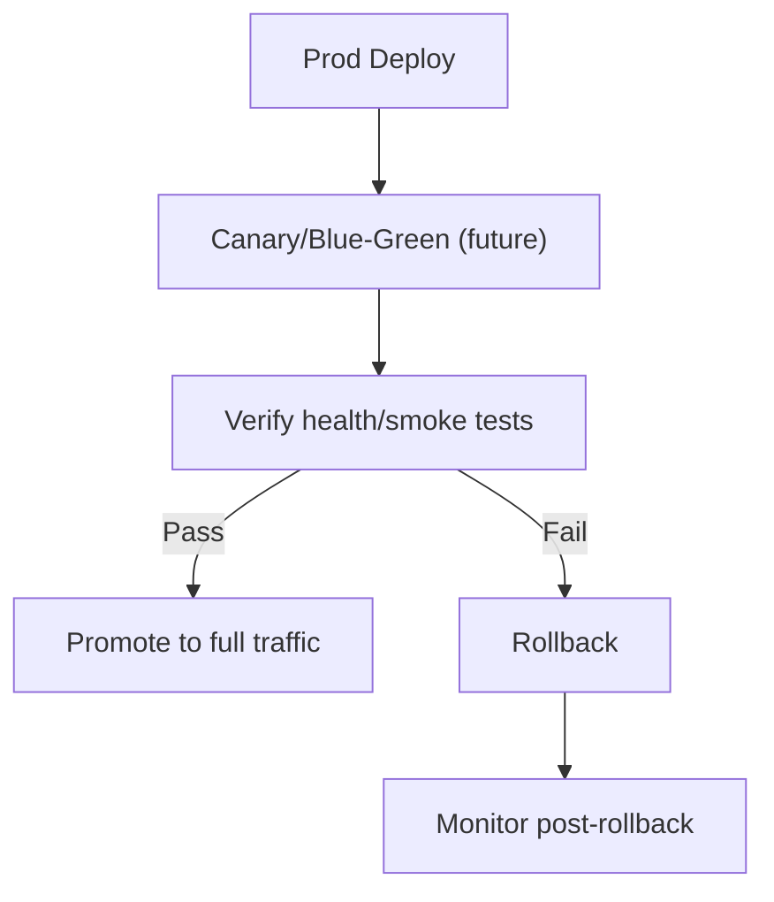

# Production Deployment

## Purpose
Define a safe, repeatable process for deploying to production.

## Prereqs
- CI checks pass (lint/test/typecheck/build).
- Docs/changelog updated; prompt archive completed.
- Secrets configured in prod environment; no missing env vars.
- Staging/beta verification completed; go/no-go approval given.

## Process (initial)
- Trigger production deploy with approval after staging verification.
- Monitor logs/metrics/alerts post-deploy; verify key flows (smoke tests).
- Rollback strategy ready (per deployability phase); document steps.

## Future Enhancements
- Canary/blue-green steps; automated health checks and rollback.
- Deployment runbooks and incident response integration.***

## Compliance/DSR Smoke (once features exist)
- Confirm privacy/consent banner in all supported locales; toggle consent off and verify no analytics emit.
- Run a test DSR delete/export and ensure propagation to derived stores is queued/completed.
- Spot-check logs for redaction; ensure no PII in errors.
- Verify role gating on admin/owner/tenant dashboards post-deploy (forbidden states OK).
- Reconfirm WAF/rate-limit rules on auth/marketplace endpoints if enabled.
